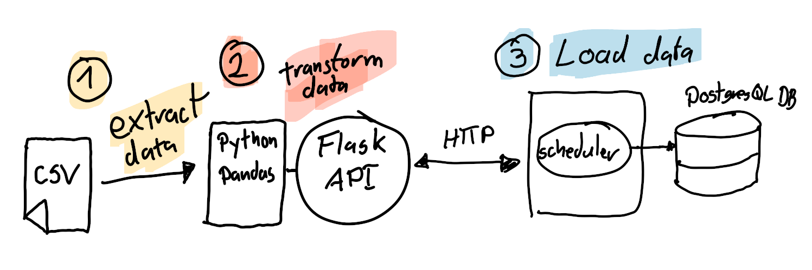
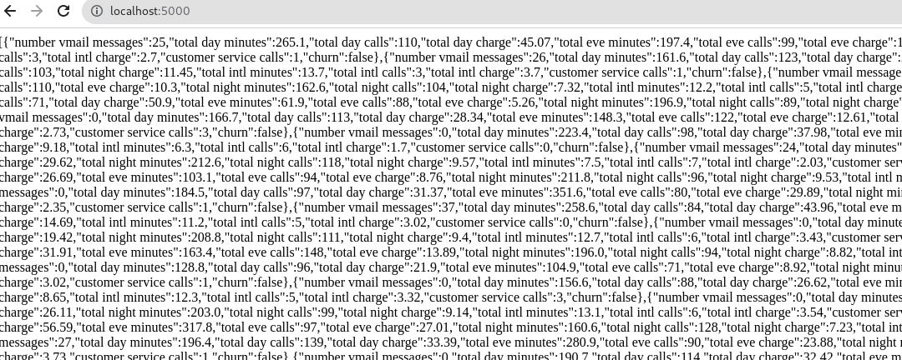

# Data Engineering - Case Study - TransUnion

> Welcome to my case study where **I intend to showcase my skills which I believe are relevant for the role of Data Engineer I at TransUnion**. In this project, I have designed an ETL Pipeline for a distributed System. I aim to demonstrate my technical skills in data engineering, along with my ability to effectively work with different technologies to solve complex data problems.

## Overview

* This case study aims to solve the problem of extracting and transforming Data stored in flat files in one server, moving it to a different server over the internet, and loading it into a Postgres Database. 

* In selecting the dataset for this case study, I purposely chose Telephony adjacent data because I believe it aligns with the type of data the Engineering Team at TransUnion may work with. I thought that familiarizing myself with this type of data would be beneficial in demonstrating my skills and understanding of the role 

* To solve this problem, the tools and technologies used include Pandas for data extraction and transformation, Flask to create a REST API for transferring data over the internet, Airflow for scheduling and PostgresQL for loading the data into a database


## Architecture

Here's a visual representation of the Data Pipeline, eventhough the scale of the project isn't that large I tried to make use of good practices that would allow it to wrok even if the volume and velocity of data were to be scaled up



* **Step 1: I will utilize the Python Library Pandas and some OOP programming we extract the data from the flat files in a server, this is donde in a way that considers scalabiluty by processing each file in slices/chunks to prevent exceeding memory limitations**

* **Step 2: I'll proceed to transform the data a little in terms of file format (from csv to Json) and ensure to eliminate some of the irrelevant data before sending it over HTTP using a Flask API to a different server**

* **Step 3: The server that receives the data will schedule the Loading Stage by reading directly from the JSON files, and inserting the Data into a PostgreSQL Database that's running locally**

# STEP 1

## Data Extraction and Transformation

We'll start with the first step, you can find the code [here](flask-api/).
Before creating the logic in the API that handles the tranfer of data, we need to extract the data from [our csv file](flask-api/data/telecom.csv)
I decided to use the **Object Oriented Programming** paradigm here in order to be able to extend the logic of the extraction if in the future I needed to work with multiple endpoints or multiple data soruces. 


```python
import pandas as pd

class CsvReader:
    def __init__(self, file_path):
        self.file_path = file_path

    def read_csv(self, chunksize):
        chunks = pd.read_csv(self.file_path, chunksize=chunksize)
        return chunks

class CsvProcessor:
    def __init__(self, file_path, chunksize):
        self.reader = CsvReader(file_path)
        self.chunks = self.reader.read_csv(chunksize)
        self.iterable_chunks = iter(self.chunks)
    
    def __transform_chunk(self, chunk):
        # Here we are removing the columns
        # that are irrelevant from the chunk
        # DataFrame
        transformed_chunk = chunk.iloc[:,3:]
        return transformed_chunk

    def __process_next_chunk(self):
        # We try to iterate the chunks until exhausted
        try:
            chunk = next(self.iterable_chunks)
        except StopIteration:
            print("End of File and Iterator")
            chunk = None
        if chunk is not None:
            chunk = self.__transform_chunk(chunk)
        return chunk
    
    def json_chunk(self):
        # Here we create a DataFrame chunk
        # and use the to_json from the pandas library to
        # return it as JSON for our API
        self.chunk = self.__process_next_chunk()
        self.chunk = self.__transform_chunk(self.chunk)
        return self.chunk.to_json(orient='records')
  ```

This approach allows for not only scalability by processing the flat files (csvs) in chunks and creating an iterator that returns each slice until all data has been exhausted, it also takes into account certain errors and exceptions that could occur and handles them and informs the user when it happens.

Next I coded up a simple API endpoint using the Pandas Library which will allow to fetch the data from our remote Server.

```python
from flask import Flask, jsonify
from csv_reader import CsvProcessor

app = Flask(__name__)
csv_file_path = 'data/telecom.csv'

@app.route('/', methods=['GET'])
def get_json():
    """
    Returns Data in JSON format using an Object
    of the class CsvProcessor we created and the json_chunk method 
    as the response to a GET request.
    """
    print("Aha")
    try:
        processor = CsvProcessor(csv_file_path,1000)
        json_chunk = processor.json_chunk()
        return json_chunk, 200
    except Exception as e:
        error_message = {'error': str(e)}
        return jsonify(error_message), 500

if __name__ == '__main__':
    app.run()
  ```
I then ran some tests and verified the GET requests were working succesfully at the specified endpoin



# Stay Tuned as I update this Case Study
# TODO 
## Scheduling and Loading Data into Database

In a virtual server in the cloud provided by Lionde
I installed Postgresql and airflow, I have come up with the callable python code
that will fetch the JSON file, connects to Postgres and executes a query to load the data into the Database

Here's a preview of the code I intend to use as well as the query


## Conclusion

So far I have been able to demonstrate a few of my skills which I believe would be relevant for the data Engineering position,
ranging from python programming and some of it's useful libraries for data centric roles.
I aim to also showcase my ability to learn quickly given that before undertaking this challange my experience with Airflow was limited
but I have now learned how to create basic DAGs and how to use the pythonOperator


